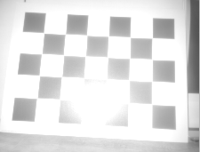
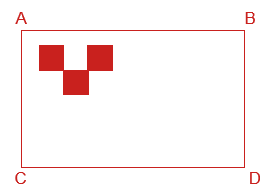
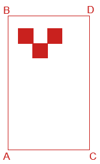
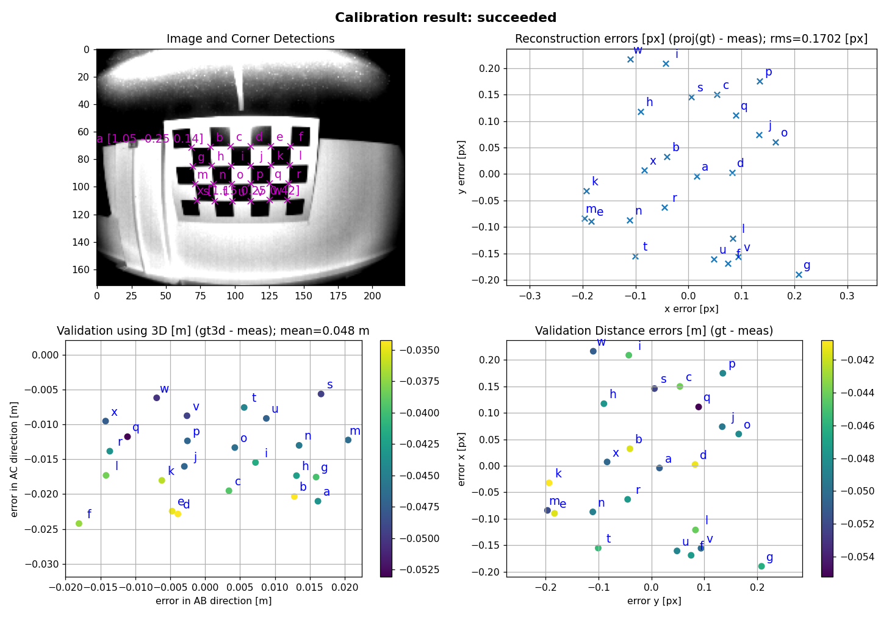

# Checkerboard Static Camera - Calibration Routine

In this calibration routine, the camera and checkerboard can not be moved/disturbed during the calibration process. 

## Prerequisites

Before proceeding to perform the calibration process we assume that the user:

- has already connected the camera head to the VPU.
- changed the PORT state from "CONF" to "RUN."
- is able to receive the 3D Data because this routine uses only the amplitude image/reflectivity image for the calibration.
- is not running the ifmVisionAssistant in parallel.
- knows the exact position of a robot coordinate system.

## Shopping list

- A checkerboard of size 800 X 600 mm is printed either directly on a thick aluminum sheet or printed on matte finish paper and pasted to a board. The calibration board can not move during one camera's complete calibration, due to the design of the process. Please find the checkerboard in PDF format {download}` here <_resources/checkerboard.pdf>`,
- Cardboard edges should not extend past the checkerboard dimensions as this will result in a calibration error.
- If using a checkerboard of another dimension, make sure to edit the dimensions in the calibration script.

## Software setup

1. Clone the documentation repository.
   ```sh
   $ git clone https://github.com/ifm/documentation.git
   ```
2. Create a virtual environment and install the required packages (run from the extrinsic_calibration/checkerboard_static_camera_calibration folder).
    ```sh
   $ python -m venv venv                # create a virtual environment
   $ source venv/bin/activate           # activate the virtual environment
   $ pip install -r requirements.txt    # install the required python packages
   $ source venv/bin/activate           # Activate the virtual environment
   ```


## Scene setup

### Position of the checkerboard

- Rest the checkerboard on a wall and make sure the checkerboard occupies the maximum field of view of the camera for the most accurate calibration.
- Move the Robot such that the Y-Axis of a Robot Coordinate System is exactly parallel to the checkerboard.

```{image} _resources/TOP_VIEW.png
:alt: top_view
:width: 400px
:align: center
```

- Tilt the board if a reflection of the illumination is seen on the camera image. You can tilt as long as the top edge is fully resting on the wall. Keep in mind that all the edges of the board still have to be visible to the camera after tilting the checkerboard.

| Good Positioning                           | Bad Positioning                          |
| ------------------------------------------ | ---------------------------------------- |
|  |  |

Please see this isometric view of a good scene to get a better understanding of the expected geometric configuration.  

```{image} _resources/isometric_view.png
:alt: isometric_view
:width: 400px
:align: center
```

### Measurements

| Camera Mounting | Checkerboard Positioning                     | Measurements                                                     |
| --------------- | -------------------------------------------- | ---------------------------------------------------------------- |
| Horizontal      |  | X_AB<br><br>Z_AB<br><br>X_CD<br><br>Z_CD<br><br>Y_AC<br><br>Y_BD |
| Vertical        |      | X_AC<br><br>Z_AC<br><br>X_BD<br><br>Z_BD<br><br>Y_AB<br><br>Y_CD |

**Robot Coordinate System** **(RCS)** is assumed to be a right-handed coordinate system and rests on the ground plane.

All measurements are in meters from the robot coordinate system to the edges of the checkerboard in a Cartesian coordinate system.
Rotation angle results are given in radiant.

**Measurements for the camera having an offset along the y-axis respective to the RCS:**

<font color=blue>(When the cameras are mounted on the sides of AGV)</font>


In this case, placing the checkerboard exactly in front of the AGV may not capture the whole checkerboard which is not desired and leads to calibration failure.

Therefore place a robot in such a way that the whole checkerboard is captured and also the Y-Axis of the RCS is exactly parallel to the checkerboard. The measurements along Y-Axis won't be equal and it is totally fine.

    Y_AC != Y_BD != 0.4m

The sample scene setup for a camera mounted on the right side of an AGV gives a better understanding of the above statement.


```{list-table}
:header-rows: 1
- * Robot Positioning
  * Image Captured
- * ```{image} _resources/RCS_CBCS.png
    :alt: RCS_CBCS
    :width: 400
    ```
  * ```{image} _resources/bad_view.png
    :alt: bad_view
    :width: 400
    ```
- * ```{image} _resources/good_configuration.png
    :alt: good_con
    :width: 400
    ```
  * ```{image} _resources/correct_view.png
    :alt: corr_view
    :width: 400
    ```
```

### Measurements for the above scene

```{list-table}
:header-rows: 1
- * Geometric Configuration
  * Description for Y_AC & Y_BD
- * ```{image} _resources/Measurements.png
    :alt: measurements
    :width: 500
    ```
  * Y_AC and Y_BD are both positive in this case 
    because the checkerboard is moved to the right side 
    to capture the whole checkerboard in the amplitude/reflectivity image.
```

## Run the calibration

In this section, we edit the `calib_cam.py` Python script to fit the user's configuration. Please read carefully the instructions below and the commends in the script on how to adjust each variable properly.

1. Enter the camera configuration

Change the `cam_port`, `ip`, `horizontal_mounting` and `upside_down` values to fit your configuration.

2. Enter the checkerboard dimensions

If you are using the standard checkerboard provided in the introduction, skip this step. 
If you are using a checkerboard of a different size, adjust the `frame_size`, `target_width` and `target_height` accordingly.

3. Enter the measurements for A, B, C and D

> Note: The values below are examples values: please input the values as measured for your setup.
```python
if horizontal_mounting:
    # A is upper left corner in the image and also in the world
    X_AB=0.4
    Z_AB=0.49
    X_CD=0.08
    Z_CD=0
    Y_AC=0.8
    Y_BD=0
```
>Note: if the camera is mounted vertically, edit the measurements in the `else` loop:
>    ```python
>    else: 
>    # Camera and target are mounted vertically
>    # A is upper left corner in the image and lower left corner in the world
>    X_AC=1.227-0.057
>    Z_AC=0.0
>    X_BD=1.227
>    Z_BD=0.798
>    Y_AB=0.3
>    Y_CD=-0.3
>    ```

4. Select your preferred data input source (we recommend using the default `ifm3dpy` input):
    ```python
    source = f"ifm3dpy://{ip}/port{cam_port}"
    ```
5. Select the image (reflectivity or amplitude) to use for calibration. By default, we recommend using the amplitude image. Only to switch to the reflectivity image if necessary to reduce the bright spot created by the camera illumination.
   ```python
    image_selection = "amplitude"
    ```
6. Run the script and check the results. If the calibration is successful then the plots will be displayed as shown in below example figure.  

```{image} _resources/successful_calibration.png
:alt: successful_calibration.png
:width: 800
:align: center
```    
    <!--  -->

7. If the Calibration succeeded then the calibration values are written to the O3R system.

8. Assess the plausibility of the generated values: open a viewer of your choice (we recommend the Vision Assistant) and verify that:
    - the generated calibration values are applied, 
    - the floor plane corresponds to Z=0,
    - vertical surfaces are parallel to the (XY) plane,
    - the axis point as you would expect (typically, X forward, Y to the left and Z up in the world frame), 
    - when calibrating multiple cameras with overlapping fields of views, check that objects only appear once. The point clouds of the calibrated cameras should overlap to create a single object.

