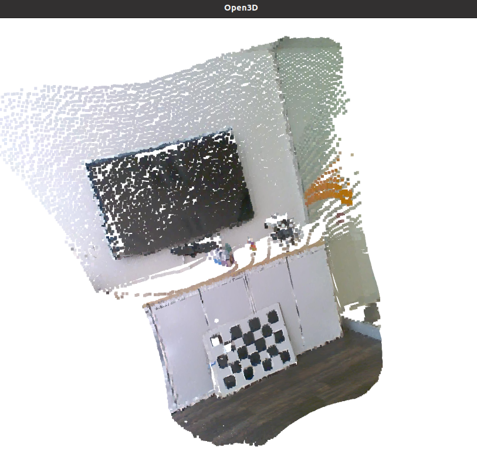

# 2D-3D Registration Example

| Last reviewed date | ifm3dpy version | O3R firmware version |
| ------------------ | --------------- | -------------------- |
| June 2023          | 1.2.6           | 1.0.14               |

This example demonstrates how to register a color image with a depth image.

More specifically, we can determine which pixel in the color image corresponds to the position of a point in the point-cloud generated by the depth image, for example:



## Procedure

1. Clone the documentation repository.
   ```sh
   $ git clone https://github.com/ifm/documentation.git
   ```
2. Create a virtual environment and install the required packages.
   ```sh
   $ python -m venv venv                # create a virtual environment
   $ source venv/bin/activate           # activate the virtual environment
   $ pip install -r ./Software_Interfaces/Toolbox/Registration2d3d/requirements.txt  # install the required python packages
   ```
4. Try the script 2D-3D_registration.py

To better understand how the script works, review the introduction to [O3R calibration](../IntroToCalibrations/README.md).

<!-- 
TODOOOO: add example output

## Example output

This is will be available soon under the jupyter notebook: 2D-3D_registration.ipynb -->
