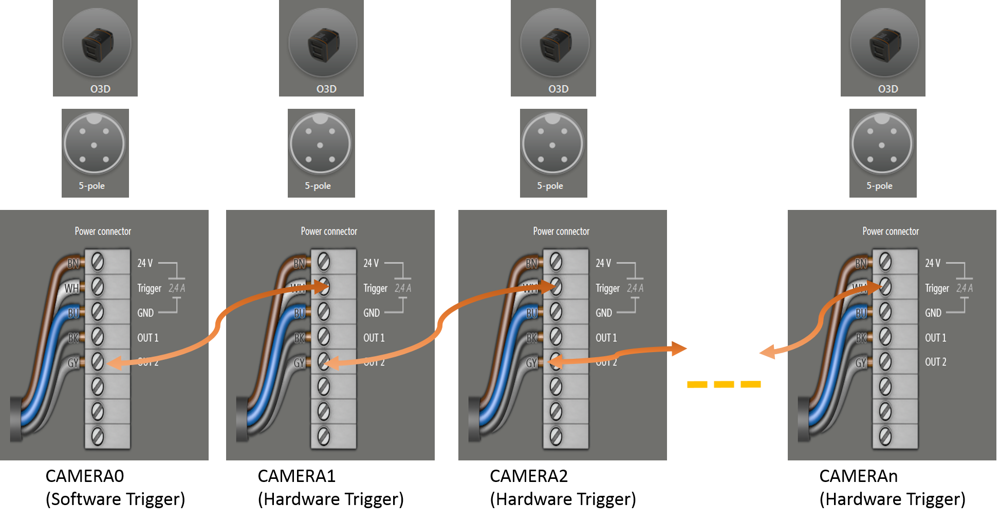
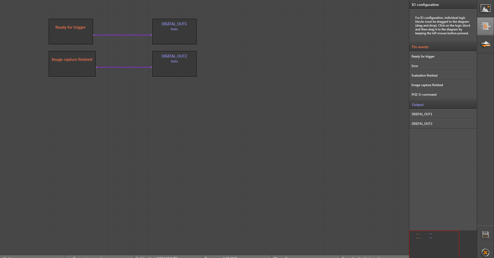

ifm3d Multiple camera parallel grabber
=======================================

This document explains the setup that is needed to use this code.
The setup is consist of multiple ifm o3d cameras out of which one is in
software trigger mode and others are configured as hardware trigger mode (Positive,Negative,Positive and Negative).
This example triggers the device in software trigger mode whose IP Address must be at 0th location of the ```camera_ips``` array. 
After the CAMERA0 (0 index camera) finished the Image capture it further sends the hardware trigger to the one of the device 
e.g.CAMERA1 (device at index 1 in ```camera_ips```array).When CAMERA1 device finishes its capture it further trigger CAMERA2 
and this way all the devices are triggered.

Setup and pin connection
------------------------

Following Images shows the setup and pin connection:



<p align="justify">
  Figure 1. Setup of the camera
</p>

Above figure explains the setup of the O3D cameras required for this example.
Trigger mode in CAMERA0 is configured as a software trigger mode. Rest all other cameras are
congfigured as hardware trigger(positive edge). When the CAMERA0 finishes the Image captured it generates the soft signal Image capture finished 
which through Logic layer is connected to the OUT2 pin (Gray Wire). This configuration of Logic layer on device device is
explained in section [logic Layer in O3D3xx](#Logic-Layer-in-O3D3xx). OUT2 pin of CAMERA0 is further connected to the hardware
trigger pin (white wire) of CAMERA1 as shown in above figure 1.  and when CAMERA1 finishes the capture it sends the output signal to its OUT2 pin which is further
connects to CAMERA3 hardware trigger pin. This way if CAMERA0 is triggered from user application it will
trigger all other camera one after the other.

Note: Pin connection and color are explained with respect to the [ifm product](https://www.ifm.com/ch/en/product/EVC073)

#### Setting unique ip address to your ifm3d camera
This is explained in detail at [this document](https://github.com/ifm/ifm3d-examples/blob/master/doc/ex-multi_camera_grabber.md#setting-unique-ip-address-to-your-ifm-3d-camera)

#### Logic Layer in O3D3xx
The Logic Layer represents a graphical view on the digital output PIN combination of the O3D3xx device. This setup as explained above, connects the Image captured finish to
OUT2 pin, TO do this we need to configure the logic graph on the device. user can do this through iVA( ifm Vision Assistant software) or can use the JSON as shown in example code. 
Following is the screenshot of the iVA which explains the how to connect the Image capture finish signal to the OUT2 PIN. IO Configuration Tab shows all 
the PIN events and outputs available with O3D3xx device.



<p align="justify">
  Figure 2. Logic Layer in O3D3xx
</p>

##### JSON for the above logical layer
Following JSON is used in code [Line 52](ex-multi_camera_parallel_grabber.cpp#L52) will configure the logic graph shown in Figure 2 on the device.
The graph is consist of block and connectors.
```json
"{
   "IOMap ": {
		    "OUT1 ":  "RFT ",
		    "OUT2 ":  "AQUFIN "
		     },
		    "blocks ": {
		            "B00001 ": {
						    "pos ": { "x ": 200, "y ": 200},
						    "properties ": {},
						    "type ":  "PIN_EVENT_IMAGE_ACQUISITION_FINISHED "
							   },
				    "B00002 ": {
						    "pos ": { "x ": 200, "y ": 75},
						    "properties ": {}, 
							"type ": "PIN_EVENT_READY_FOR_TRIGGER "
							   },
				    "B00003 ": {
						    "pos ": { "x ": 600, "y ": 75},
						    "properties ": { "pulse_duration ": 0},
						    "type ":  "DIGITAL_OUT1 "
						       },
				    "B00005 ": {
						    "pos ": { "x ": 600, "y ": 200},
						    "properties ": { "pulse_duration ": 0},
						    "type ":  "DIGITAL_OUT2 "
								}
						},
			 "connectors ": 
						{
					 "C00000 ": {
							 "dst ":  "B00003 ",
							 "dstEP ": 0,
							 "src ":  "B00002 ",
							 "srcEP ": 0
								},
					 "C00001 ": {
							 "dst ":  "B00005 ",
							 "dstEP ": 0,
							 "src ":  "B00001 ",
							 "srcEP ": 0
								}
						}
}"
```
Note : Ready for Trigger is not use in example code but it is always good to use this to get the feedback on Device LED when the device is ready for trigger. 
 
