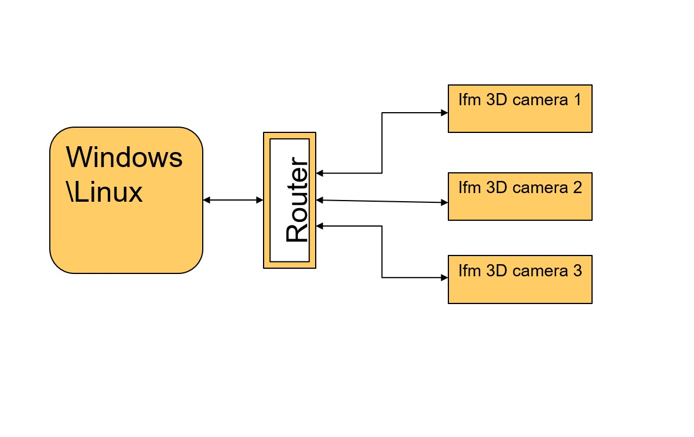

ex-multi_camera_grabber
=========================

The primary objective of this example is to demonstrate how to accquire frames from multiple ifm 3D camera's.

The code in this example capture's frames from multiple 3D cameras which are configured to be triggered through software,  
and display's the time stamp of the frame received. It also measues the time taken to receive the set of frames.

The below diagram is representational image of the setup used for this example consisting of a PC and three 3D-camera all on the same network.  
This can be used as a reference to setup your PC/3D-camera network.  
  
Inorder to try out this example following are the pre-requisites: 

+ Each camera used should be configured to use "Process Interface" for trigger.
+ Each of your camera need's to have an unique IP Address.
+ You should be able to ping each of the camera from the PC on which this code executes.
+ Incase your network uses a proxy, you will need to configure your system to bypass the proxy for the used IP's.

Setting unique IP Address to your ifm 3D camera
--------------------------------------------------
The following set of IP-addresses are utilised in the example code, these can be changed as per your setup.

+ camera 1: 192.168.0.70
+ camera 2: 192.168.0.71
+ camera 3: 192.168.0.72

Incase your O3X/O3D camera's are having conflicts due the default IP 192.168.0.69 being set,  
you can set a unique IP addresses for your camera using the ifm Vision Assistant or by just following the step by step guide below.

Connect the first camera to the network and execute the following command:

```commands
ifm3d --ip=192.168.0.69 dump > camera1_config.json
```
Edit the JSON file with an editor of your choice to set the field **ifm3d.Net.StaticIPv4Address** to **192.168.0.70**.
Save the file.

configure the new IP to your camera with the following command:

```commands
ifm3d --ip=192.168.0.69 config < camera1_config.json
```
After this add the second camera to the network and repeat the above steps to set the next IP to 192.168.0.71 and so on for the rest of the camera's.

**Using jq**

If you prefer to use jq, a single step command can be used to set IP address of the camera,
Connect the first camera to the network and execute the following command:

```commands
ifm3d --ip=192.168.0.69 dump | jq ".ifm3d.Net.StaticIPv4Address=\"192.168.0.70\"" | ifm3d --ip=192.168.0.69 config
```
this will set the IP of first camera to 192.168.0.70.

After this add the second camera to the network, set the next IP with the below command and so on:


```commands
ifm3d --ip=192.168.0.69 dump | jq ".ifm3d.Net.StaticIPv4Address=\"192.168.0.71\"" | ifm3d --ip=192.168.0.69 config
```


