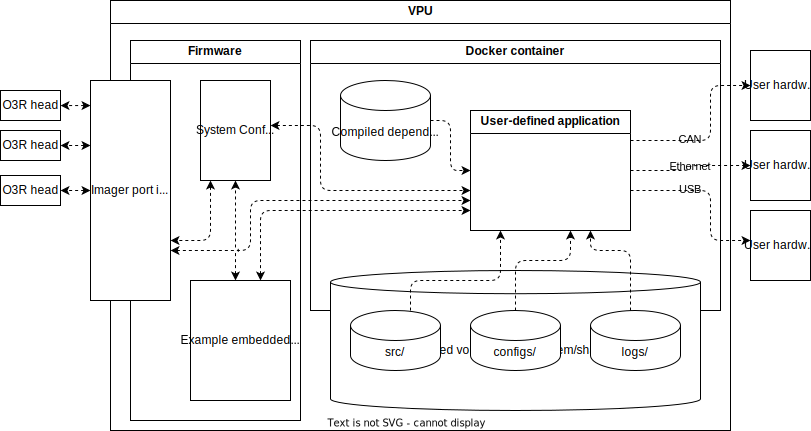

# O3R docker manager

## Why this library exists

The o3r camera system is setup to facilitate the usage of docker containers to deploy applications to the VPU (OVPxxx).

The ifm3d c++/python api allows a developer to write applications using the o3r on their local machine and then recompile those applications to run directly on the VPU with minimal overhead. This library incorporates lesson from the ifm3d.com documentation on docker implementations. For each robust production ready solution a few common tools and practices are standard. An opinionated set of these tools are provided by this o3r deployment library to facilitate convenient and reliable deployment of 3rd party applications to the o3r platform.

- System for setting up and sharing a common directory between the running application and the rest of the VPU (see docker volumes documentation)
- Reccommended log cache file structure and logging tools for python (and soon c++)
- System for collating application logs in a consistent way whenever the developer connects to the vpu to perform updates/troubleshooting
- "One-click" solution deployment scripting

The following architecture is prescribed to minimize feedback loops during the development process:




## Quick start

### Clone the repo

`git clone URL/to/o3r_docker_manager.git`

### Install the management requirements

`pip install -r ./o3r_docker_manager/requirements.txt`

### Setup docker image

If you have access to a docker image containing the dependencies for a particular example or project, excellent! Otherwise follow the instructions below to setup the dependencies needed in order to build the example containers automatically.

#### Windows

Install wsl2 with an ubuntu system as default and follow the instructions for setting up the docker dependencies in linux.

#### Ubuntu

Install Docker and qemu according to the docs on ifm3d.com

### Install the manager utility

Use either the latest release from PyPI

`pip install -e ./o3r_docker_manager`

Or the locally cloned copy

`pip install -e ./o3r_docker_manager`

### Run example docker container deployment via CLI with python stack...

```sh
cd deployment_examples
o3r_docker_manager --docker_build "./python_deps.Dockerfile>./docker_python_deps.tar"
```

## Other examples

### Run example docker container deployment via CLI with c++ stack...

### Run example docker container deployment via CLI with ROSI stack...

### Run example docker container deployment via CLI with ROSII stack...

### Run example docker container deployment via CLI with nvidia/cuda/pytorch stack...

## Alternate Usage

How to use for programatic testing of o3r examples...

```python
from ... import SSHClient, SCPClient
from o3r_docker_manager import deployment_manager

IP = ....
ssh: SSHClient, scp: SCPClient = deployment_manager.get_communication_handles(IP)
```

## Make the solution your own

### Add a source folder and other assets to the solution...

### use asset logging for testing...

### Why am I not seeing any output from my container? how do I know what went wrong?...

### python stack...

###  add python dependencies...

### cpp stack...

###  using layered images to minimize compile time...

### ROSI stack...

### ROSII stack...

### GPU stack...

### how to profile container performance...


## Preparing for production deployment...

### enabling/disabling autostart of docker containers...

### Consider options for maximizing SSD lifespan (minimal logging vs. lots of logging vs. offboard logging)...

### Strategies for convenient deployment ...

