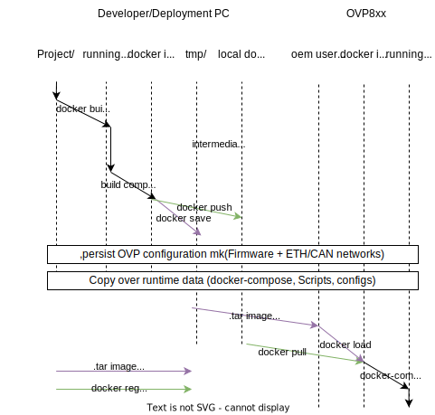
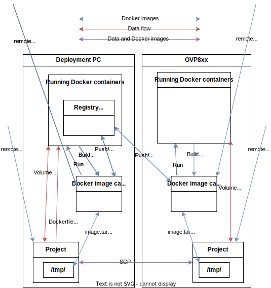
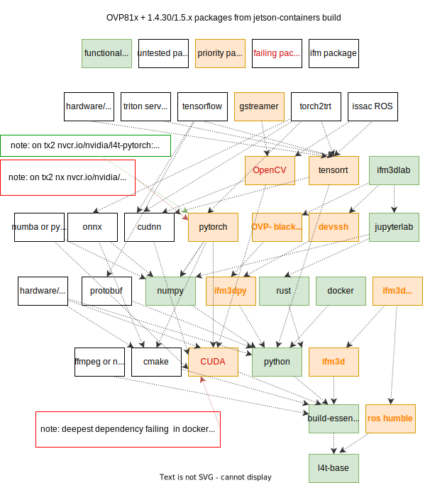

# Docker demo examples for the OVP8xx

This directory includes demos and deployment tools for running user-defined applications to the OVP.

## Tools

### ovp_docker_utils

[ovp_docker_utils](https://pypi.org/project/ovp-docker-utils/) is a thin python wrapper around ifm3dpy, paramiko, scp libraries as well as the docker api. It provides boilerplate for rapid feedback loops in development and a starting point for deployment of applications in production. It is versioned so that it does not interface with uncompatible versions of o3r firmware.

ovp_docker_utils seeks to build upon the dusty-nv/jetson-containers package to include tools for both developing within and deploying applications to the OVP.

The example to use this library is in ./ovp8xx/docker/deployment_examples.py it can be run interactively or as a script.

The script deployment_examples.py wraps docker, ssh, scp, and ifm3dpy to accomplish the workflow roughly depicted in the swimlane diagram below:

For a better sense of the available data pathways in the deployment workflow, see the schematic below:

### Pre-requisites to deploy a pre-built *.tar file

- Python compatible with ifm3dpy (3.8-3.12 as of writing) and dependencies from ./ovp8xx/docker/requirements-deployment.txt

This is the scenario where a developer has already built a docker image and exported it to a *.tar file. An engineer in production or in the field can then use a simple app to deploy the image to the OVP.

#### Pre-requisites to build a container in development

- Python, as mentioned above, and the following...
- git
- (on windows) [WSL2](https://learn.microsoft.com/en-us/windows/wsl/install) with Ubuntu 20.04 or 22.04
- Docker [installed on Ubuntu](https://docs.docker.com/engine/install/ubuntu/) including [post-installation steps](https://docs.docker.com/engine/install/linux-postinstall/)
- Qemu installed on Ubuntu per [qemu-user-static repo](https://github.com/multiarch/qemu-user-static)
    - `sudo apt-get install qemu binfmt-support qemu-user-static && docker run --rm --privileged multiarch/qemu-user-static --reset -p yes`

### Usage

Running "python ./ovp8xx/docker/deployment_examples.py --help" Shows available options.

Try running `python ./ovp8xx/docker/deployment_examples.py [Options] ifm3dlab` to attempt to automatically build a simple docker image save it as a tar image and deploy it to the connected OVP with a docker-compose file to define the runtime behavior, shared volumes, network config, etcetera.

### Jetson Utilities:

## **DISCLAIMER**:

This software and the accompanying files are provided "as is" and without warranties as to performance, merchantability, or any other warranties whether expressed or implied. The user must assume the entire risk of using the software.

**LIABILITY**:

In no event shall the author or contributors be liable for any special, incidental, indirect, or consequential damages whatsoever (including, without limitation, damages for loss of business profits, business interruption, loss of business information, or any other pecuniary loss) arising out of the use of or inability to use this software, even if the author or contributors have been advised of the possibility of such damages.

## Further documentation
See the respective documentation on the [ifm3d developer portal](https://ifm3d.com/latest/SoftwareInterfaces/Docker/index_docker.html).