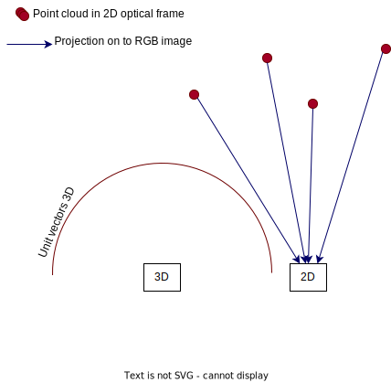

# Toolbox:
Within the Toolbox, you find helper scripts, including:
* Angle converter: this script showcases two functions from the `o3r_algo_utilities` python package 
* Extrinsic calibration:
    * `extrinsic_calib_verification.py`: is a script to verify the extrinsic calibration from h5 data.
* H5 to ifm3d lib converter
* 2D-3D registration script

## 2D-3D registration

This example shows how to find the closest pixel in the RGB image corresponding to each pixel in the distance image, in order to generate a colored point cloud.

The process is done in several steps:
- Calculate the point cloud from the unit vectors of the 3D camera and the distance value for each pixels. Unit vectors are vectors of length 1 which point in the direction in which the pixel is "looking". They are calculated using the intrinsic parameters of the optical system. This point cloud represents the (X, Y, Z) coordinates of all the pixels in the scene, in the camera's optical frame, which is the center of the chip.

- Then, this point cloud needs to be transformed to the 2D camera's optical system. This is done using the extrinsic parameters from the 3D optical system to the camera head, from the camera head to the user-defined coordinate system, and from the camera head to the 2D optical system.

- The transformed point cloud can then be projected on to the 2D image, using the 2D intrinsic parameters. Each pixel of the 2D image on which a point from the point cloud is projected is selected as corresponding to the original 3D pixel. 

