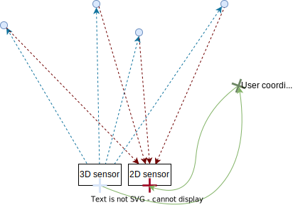

# Toolbox:
Within the Toolbox, you find helper scripts, including:
* Angle converter: this script showcases two functions from the `o3r_algo_utilities` python package 
* Extrinsic calibration:
    * `extrinsic_calib_verification.py`: is a script to verify the extrinsic calibration from h5 data.
* H5 to ifm3d lib converter
* 2D-3D registration script

## 2D-3D registration

This example shows how to find the closest pixel in the RGB image corresponding to each pixel in the distance image, in order to generate a colored point cloud.

The process is done in several steps:

1. Calculate the point cloud from the unit vectors of the 3D camera and the distance value for each pixels. Unit vectors are vectors of length 1 which point in the direction in which the pixel senses light. They are calculated using the intrinsic parameters of the optical system. This point cloud represents the surfaces visible to the tof imager with 0,0,0 representing the center of the 3D optical frame
2. Transform the point cloud to the world frame using the extrinsic parameters of the camera
3. Transform the point cloud to the 2D camera optical frame using the extrinsic parameters of the camera this will provide the pixel coordinates of the point cloud in the 2D camera frame. This allows us to associate color information to the point cloud.

The same process would be used to associate an object identified in the 2D camera frame to specific points in the 3D point cloud. This is useful for example to associate a mask derived from human-segmentation algorithms to the 3D point cloud for an accurate measure of proximity.