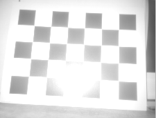
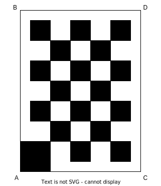

# Static camera calibration routine

The idea of this process is to automatically find out the position of the camera in the robot coordinate system. To do so, a checkerboard calibration pattern is positioned in front of the camera. The coordinates of the checkerboard corners are measured and, from those, the algorithm computes the three rotation values of the camera.
In this routine, the camera and checkerboard have to remain static.

## Shopping list

- A checkerboard of size 800 X 600 mm is printed either directly on a thick aluminum sheet or printed on matte finish paper and pasted to a board. The board is expected to be flat.
The calibration board can not move during one camera's complete calibration. 
Please find the checkerboard in PDF format {download}` here <_resources/checkerboardCalibrationTarget_600X800.pdf>`. It is important to print it at scale and to respect the size of the white margins around the checkerboard.
- Make sure the white margins around the checkerboard come all the way to the edges of the rigid board it is glued on. If the board is visible around the checkerboard, the measurements described below will be wrong.
- If using a checkerboard of another dimension, make sure to edit the dimensions in the calibration script. Also refer to the [tolerances](#tolerances) section for precision requirements.

:::{warning}
The checkerboard target has been updated to a checkerboard with a corner larger than the others (denoting the corner A). This is intended to facilitate the identification of the four corners. Running the procedure with the previous checkerboard still works.
:::

## Prerequisites

Before performing the calibration, we assume that the user:

- has already connected the camera head to the VPU,
- changed the port state from "CONF" to "RUN," and all the other ports to "CONF,"
- is able to receive 3D data from the camera, because this routine uses only the amplitude image or the reflectivity image,
- is not running the ifmVisionAssistant in parallel,
- knows the exact position of the robot coordinate system (RCS),
- know the translation values of the camera in the RCS.

## Software setup

1. Clone the documentation repository.
   ```sh
   $ git clone https://github.com/ifm/documentation.git
   ```
2. Create a virtual environment (optional) and install the required packages (run from the SoftwareInterfaces/Toolbox/ExtrinsicCalibration/StaticCameraCalibration folder).
    ```sh
   $ python -m venv venv                # create a virtual environment
   $ source venv/bin/activate           # activate the virtual environment
   $ pip install -r requirements.txt    # install the required python packages
   $ source venv/bin/activate           # activate the virtual environment
   ```


## Scene setup

### Position of the checkerboard

- Rest the checkerboard on a wall and make sure the checkerboard occupies the maximum field of view of the camera for the most accurate calibration.
:::{note}
If the camera is vertical, place the checkerboard vertically.
:::
- Move the robot such that the Y-axis of the RCS is exactly parallel to the checkerboard.

```{image} _resources/TOP_VIEW.png
:alt: Top view of the robot and the checkerboard
:width: 400px
:align: center
```

- If a reflection is seen on the camera image, you have two options:
    - Tilt the board. You can tilt as long as the top edge is fully resting on the wall. Keep in mind that all the black cells of the board still have to be visible to the camera. See image below:
      | Good Positioning                           | Bad Positioning                          |
      | ------------------------------------------ | ---------------------------------------- |
      |  |  |

    - Pick the ambient light mode (`mode = "extrinsic_calib"`). See how to edit this in the code [below](#run-the-calibration).

Please see this isometric view of a good scene to get a better understanding of the expected geometric configuration.  

```{image} _resources/isometric_view.png
:alt: isometric_view
:name: front_centered_cam
:width: 400px
:align: center
```


### Measurements
The idea is to provide the (X, Y, Z) coordinates, in the RCS, of the four corners of the checkerboard.
The coordinates will depend on the scene, and on whether the camera is mounted to the front, side, back, etc.

It is possible to compute the three translation values for the camera, in addition to the rotations. However, we recommend to input known values for the translations, to increase the robustness of the generated rotation values. These translations can be extracted from CAD drawings of the robot.

#### Tolerances

When calibrating a camera for use with [ODS](../../../../ODS/index_ods.md), it is required that the rotation tolerances do not exceed 1°.

To achieve this, ensure the following:
- For the narrow opening angle camera, O3R222, the checkerboard should be positioned at around 0.8 meters from the camera. The measurement error for each corner should not exceed 5 mm. 
- For the wide opening angle camera, O3R225, the checkerboard should be positioned at around 0.5 meters from the camera. The measurement error for each corner should not exceed 3 mm. 
- For checkerboards of different dimensions or positioned further or closer to the camera, the maximum measurement error can be scaled up or down from the values above. For example, for an O3R222 camera and for a checkerboard of half the default size, positioned at 40 cm from the camera, each measurement error must not exceed 2.5 mm,
- The checkerboard should not be placed closer than 25 cm from the camera. This is to avoid a blurry image,
- Ensure that the provided translation values of the camera are accurate at 5 mm.

#### Example - front centered camera
For a camera mounted to the center along the Y-axis of the front of the robot, the measurements would be the following (see [image above](#front_centered_cam)):

| Camera Mounting | Checkerboard Positioning                     | Measurements                                                     |
| --------------- | -------------------------------------------- | ---------------------------------------------------------------- |
| Horizontal      |  | `X_AB`<br>`Z_AB`<br>`X_CD`<br>`Z_CD`<br>`Y_AC`<br>`Y_BD` |
| Vertical        |      | `X_AC`<br>`Z_AC`<br>`X_BD`<br>`Z_BD`<br>`Y_AB`<br>`Y_CD` |

:::{note}
The RCS is assumed to be a right-handed coordinate system and rests on the ground plane.
:::

All measurements are in meters from the robot coordinate system to the edges of the checkerboard in a Cartesian coordinate system.
Rotation angle results are given in radiant.

#### Example - front camera, shifted

When the cameras are mounted to the front of the robot but shifted along the Y-axis, the checkerboard might not be in the field of view of the camera if placed exactly in front of the robot.

Therefore, place a robot in such a way that the whole checkerboard is captured and also the Y-axis of the RCS is exactly parallel to the checkerboard. The measurements along Y-axis won't be equal and it is totally fine.

For this example scene, pictured in the image below, the measurements of Y_AC and Y_BD are both positive. 
This is because the checkerboard is moved to the right side to capture the whole checkerboard in the amplitude/reflectivity image.

```{image} _resources/Measurements.png
:alt: Measurements for a checkerboard shifted to the right
:width: 500
```

## Run the calibration

In this section, we edit the `calib_cam.py` Python script to fit the user's configuration. Please read carefully the instructions below and the commands in the script on how to adjust each variable properly.

:::{note}
Each section that need to be edited by the user is marked with the comment `# EDIT HERE`
:::

1. Change the `cam_port`, `ip`, `horizontal_mounting` and `upside_down` values to fit your configuration.

2. Provide the values of the translation of the camera. These can be extracted from CAD drawings or measured manually. It is possible to run the calibration without these translation values, but the results will be less precise.
    ```python
    fixed_translation = [0.5, 0, 0.25]
    ```

2. Enter the checkerboard dimensions.
  If you are using the standard checkerboard provided in the introduction, skip this step. 
  If you are using a checkerboard of a different size, adjust the `frame_size`, `target_width` and `target_height` accordingly.

3. Enter the measurements for A, B, C and D
    > Note: The values below are examples values: please input the values as measured for your setup.
    ```python
    if horizontal_mounting:
        # A is upper left corner in the image and also in the world
        X_AB=0.4
        Z_AB=0.49
        X_CD=0.08
        Z_CD=0
        Y_AC=0.8
        Y_BD=0
    ```
    >Note: if the camera is mounted vertically, edit the measurements in the `else` loop:
    >    ```python
    >    else: 
    >    # Camera and target are mounted vertically
    >    # A is upper left corner in the image and lower left corner in the world
    >    X_AC=1.227-0.057
    >    Z_AC=0.0
    >    X_BD=1.227
    >    Z_BD=0.798
    >    Y_AB=0.3
    >    Y_CD=-0.3
    >    ```

4. Select your preferred data input source (we recommend using the default `ifm3dpy` input):
    ```python
    source = f"ifm3dpy://{ip}/port{cam_port}"
    ```
5. Select the mode to use for the image. The `extrinsic_calib` mode uses ambient light and mitigates possible reflections from the camera. If there is not enough ambient light, switch to `standard_range2m` which uses infrared illumination.
    ```python
    mode = "extrinsic_calib"
    # mode = "standard_range2m"
    ``` 
8. If the calibration succeeded, then the calibration values are written to the O3R system.

    ```{image} _resources/successful_calibration.png
    :alt: successful_calibration.png
    :width: 800
    :align: center
    ```    

9. Assess the plausibility of the generated values: open a viewer of your choice (we recommend the Vision Assistant) and verify that:
    - the generated calibration values are applied, 
    - the floor plane corresponds to Z=0,
    - vertical surfaces are parallel to the (XY) plane,
    - the axis point as you would expect (typically, X forward, Y to the left and Z up in the world frame), 
    - when calibrating multiple cameras with overlapping fields of views, check that objects only appear once. The point clouds of the calibrated cameras should overlap to create a single object.

