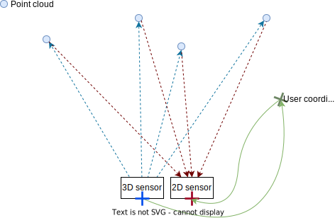

# Toolbox

Within the Toolbox, you find helper scripts, including:

- `collect_calibrations.py`: this is a helper script that gathers calibration information for all the connected heads.
- `h5_to_pcd_converter.py`: converts point cloud data from H5 files recorded with the ifmVisionAssistant to open3D PCD format.
- `registration_2d_3d.py`: shows how to find the color pixel corresponding to a distance pixel. See more details on the process below.
- `rot_human_read.py`: this script showcases two functions from the `o3r_algo_utilities` Python package that convert angles from Euler angles in radians to (roll, pitch, yaw) angles in degrees that are easier to interpret.
- `extrinsic_calibration/static_camera_calibration/calib_cam.py`: this is a script to use to perform the static calibration process using a checkerboard. Make sure to closely follow the instructions in the accompanying README.
- `update_settings_to_new_fw_schema.py`: this script can be used to update a configuration file from one firmware version to another, in the case where the schema was updated including breaking changes. The script will list out all the settings that were deleted and the user should check if these should be reapplied. This script expect a system with the same hardware configuration as the JSON configuration to be replicated.

## `registration_2d_3d.py`

This example shows how to find the closest pixel in the RGB image corresponding to each pixel in the distance image, in order to generate a colored point cloud.

The process is done in several steps:

1. Calculate the point cloud from the unit vectors of the 3D camera and the distance value for each pixels. Unit vectors are vectors of length 1 which point in the direction in which the pixel senses light. They are calculated using the intrinsic parameters of the optical system. This point cloud represents the surfaces visible to the TOF imager with (0, 0, 0) representing the center of the 3D optical frame.
2. Transform the point cloud to the user's coordinate system using the extrinsic calibration parameters of the camera.
3. Transform the point cloud to the 2D camera optical frame using the extrinsic calibration parameters of the 2D camera. Projecting the point cloud using the 2D camera's inverse intrinsic parameters will allow us to associate color information to the point cloud.

The same process would be used to associate an object identified in the 2D camera frame to specific points in the 3D point cloud. This is useful for example to associate a mask derived from human segmentation algorithms to the 3D point cloud for an accurate measure of proximity.
