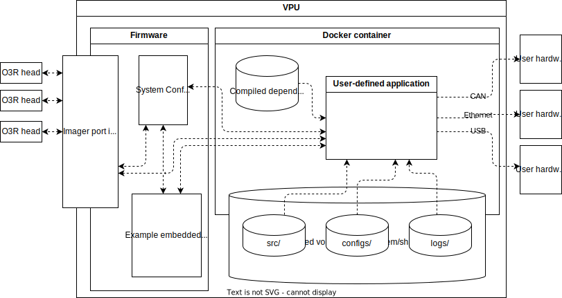

# Zone server for ifm's o3r-based Obstacle Detection System (ODS)

This zone-server application is built as a wrapper for ODS to manage zones, camera views, and communication of zone-occupancy data with 3rd party vehicle controllers.

These vehicle controllers either cannot implement ifm3d/ifm3dpy directly or they would like to use a simplfied interface and offload the management process to the o3r VPU.

The application can run on windows/linux PC and control an external VPU, or it can run on the VPU.

This application is provided AS-IS and it is essential that engineers implementing ODS through this solution familiarize themselves with ODS, it's control flow, it's capabilities, it's limitations, and how this application performs with their particular hardware.


## Prerequisites

1. [Firmware](https://ifm3d.com/documentation/Firmware/fw_update.html) - The library has been tested with VPU firmware version 1.0.14.
2. Static IP address matches subnet any interface that you would like to connect with via Eth0. Modify this [via CLI](https://ifm3d.com/documentation/Technology/VPU/ethernet.html?highlight=ip%20address) or ifmVisionAssistant:   
    3. Set the IP address of the PC's ethernet port to match the subnet of the o3r default (192.168.0) and the subnet of the controller in use
    4. Open Vision Assistant and find the device
    5. Under VPU settings> Eth0 : set DHCP off and set IP address to be ([subnet of controller].69) _and_ the Gateway to be ([subnet of controller].201) and save changes. The VPU will reboot.
3. A VPU with ODS enabled and an engineer who has familiarized themselves with [it's operation](https://ifm3d.com/documentation/ODS/index_ods.html).
4. linux running docker+qemu. Native Ubuntu is reccomended. This is only required for the building of a docker container. Once built with the required python dependencies, deployment is simple on any platform using the included scripts under `./deploy`

## Schematic




```bat
cd zone_server_1_0_14

wsl docker build --platform linux/arm64 -f "Dockerfile" . -o "type=tar,dest=docker_python_deps.tar"

o3r_docker_manager  ^
--IP "192.168.0.69" ^
--log_level "INFO" ^
--transfers "./src>~/share/src,./configs>~/share/configs" ^
--setup_docker_compose "./docker-compose.yml,./docker_python_deps.tar,home/oem/share,oemshare" ^
--enable_autostart "" ^
--disable_autostart "" ^
--log_caching "/home/oem/share/logs>~/o3r_logs/From_VPUs" ^
--initialize "docker-compose.yml" ^
--attach_to "zone_server" ^
--set_vpu_name "zone_server_vpu_000"
```


```bat
cd deployment_examples

wsl docker build --platform linux/arm64 -f "python_deps.Dockerfile" . -o "type=tar,dest=docker_python_deps.tar"

o3r_docker_manager ^
--IP "192.168.0.69" ^
--log_level "INFO" ^
--transfers "./oem_logging_example.py>~/share/oem_logging_example.py,./oem_logging.py>~/share/oem_logging.py,./configs>~/share/configs" ^
--setup_docker_compose "./example_dc.yml,./docker_python_deps.tar,/home/oem/share,oemshare" ^
--enable_autostart "" ^
--disable_autostart "" ^
--log_caching "/home/oem/share/logs>~/o3r_logs/From_VPUs" ^
--initialize "example_dc.yml" ^
--attach_to "example_container" ^
--set_vpu_name "oem_app_test_vpu_000"
```
in linux

```sh
cd deployment_examples

docker build --platform linux/arm64 -f "python_deps.Dockerfile" . -o "type=tar,dest=docker_python_deps.tar"

o3r_docker_manager \
--IP "192.168.0.69" \
--log_level "INFO" \
--transfers "./oem_logging_example.py>~/share/oem_logging_example.py,./oem_logging.py>~/share/oem_logging.py,./configs>~/share/configs" \
--setup_docker_compose "./example_dc.yml,./docker_python_deps.tar,/home/oem/share,oemshare" \
--enable_autostart "" \
--disable_autostart "" \
--log_caching "/home/oem/share/logs>~/o3r_logs/From_VPUs" \
--initialize "example_dc.yml" \
--attach_to "example_container" \
--set_vpu_name "oem_app_test_vpu_000"
```


## Control flow

`src/zoneserver.py` is the entrypoint of the application. This is where error handling and persistent logging is done.

'Adapters' are how the zone server communicates with any number of external devices. Adapter objects are initialized by zoneserver.py. No more than one adapter can be a 'controller' of the zone server, but all adapters can be 'recievers' of zone-occupancy data. This may come in handy if a customer wants the application to alert both a vehicle manager IPC and a safety PLC that there is an obstacle in the path of the vehicle. Most commonly, a second adapter can be used to debug and stress test applications

The base example of an adapter is the REST api. It is meant for implementations with minimal latency requirements (i.e. very slow moving vehicles), or simply testing out the zone server.

New adapters can be written to use very different underlying behavior. They may be purpose-built for a particular system rather than support a generic communications protocol. More information is provided in the adapter section of the documentation as to the specific functionality required and design recommendations.

## Usage

The simplest way to get started with the zone server is to use the default configuration and run the application on a computer attached to the VPU.

If you have two cameras, you can use the extrinsic calibrations provided (this would be two cameras pointing in opposite directions, +x and -x, and labels facing up, +z)

Connect the "forward" camera 3d cable to port 0, and the reverse camera 3d cable to port 1.

Install "./requirements.txt" and the `./src/adapters/adapter_name/requirements.txt` for each adapter you would like to use. see the following section for configuring adapters.

Run `./src/zone_server.py`. Using the default settings, the rest api should be now available in the browser at http://127.0.0.1:8000. From here one can set the zone-setting via the /zone_set/ or /ad_hoc/ methods or read the state of the zone server using the /sync/ method.

Some adapters (such as tinycan) will only run with a compatible adapter, or if the zone server application is running on the VPU itself, for this, see deployment instructions

### Configuration


The default configuration is provided under configs/config.json

If another configuration should be used, specify  this under configs/which_config.

The configuration of the zone server is similar to the configuration of the VPU itself in that they are both json.

There is not yet schema validation of the configuration. It's important to understand what each component does.

(Optional) Comments are not valid in standard json so annotations are provided here in the documentation.
``` json
{
    "comments":"base config",
}
```

Specification of the VPU IP address (required if the zone server is running on a PC connected to the VPU).
```json
{
    "Eth0": "192.168.0.69",
}
```

How many bytes of disk space should be used for rotating logs (0 for no caching of logs).
```json
{
    "total_cached_log_size": 1e8,
}
```

How will the zone server be controlled and where will the output be sent...
Each adapter module shares a set of common functions for controlling the zone server (defining the zone configuration) and then recieving data from the zone server.
```json
{
    "adapters":[
        {
            "type":"rest",
            "params":{
                "controller": 1,
                "reciever": 1,
                "port":8000
            }
        }
    ],
}
```

(Optional) The configuration of other adapters that are not used in the current configuration
```json
{
    "unused_adapters":[
        {
            "type":"tinycan",
            "params":{
                "controller": 0,
                "reciever": 1,
                "log_level": "debug",
                "managed_id": "0x64",
                "ods_framerate": 10,
                "bustype": "socketcan",
                "bitrate": 125000,
                "sync_offset_ms": -1,
                "heartbeat_time_ms": 2000
            }
        }
    ],
}
```

(optional) the basic dimensions of the vehicle. This is used if one is running the ods_demo_client.py script on their pc connected to the VPU
```json
{
    "vehicles": [
        {
            "vehicle_name": "LD-60",
            "extent": [
                [
                    0,
                    0.25
                ],
                [
                    -0.65,
                    0.25
                ],
                [
                    -0.65,
                    -0.25
                ],
                [
                    0,
                    -0.25
                ]
            ],
            "height": 2
        }
    ]
}
```

The positions of each camera and the vpu itself. The "ports" configuration here is the same schema as the standard VPU configuration.
```json
{
    "ports": {
        "port0": {
            "processing": {
                "extrinsicHeadToUser": {
                    "rotX": 0.0,
                    "rotY": 1.5707963267948963,
                    "rotZ": -1.5707963267948968,
                    "transX": 0.0,
                    "transY": 0.0,
                    "transZ": 0.8
                }
            }
        },
        "port1": {
            "processing": {
                "extrinsicHeadToUser": {
                    "rotX": 0.0,
                    "rotY": 1.5707963267948963,
                    "rotZ": 1.5707963267948968,
                    "transX": 0.0,
                    "transY": 0.0,
                    "transZ": 0.8
                }
            }
        },
        "port6": {
            "processing": {
                "extrinsicVPUToUser": {
                    "rotX": 0.0,
                    "rotY": 0.0,
                    "rotZ": 0.0,
                    "transX": -0.25,
                    "transY": 0.0,
                    "transZ": 0.8
                }
            }
        }
    }
}
```

The various sets of cameras that are expected to be running at any given time
```json
{
    "views": {
        "forward": {
            "3Dports": [
                0
            ]
        },
        "reverse": {
            "3Dports": [
                1
            ]
        },
        "forward+reverse": {
            "3Dports": [
                0,1
            ]
        }
    }
}
```

The definitions for each zone set to be used for the vehicle. The keys should be strings of integer literals for integers>0.
"0" is reserved for the 'idle' state (no imaging occuring)
```json
{
    "zones": {
        "1": {
            "comment": "forward - unladen",
            "zone0": [[0.0,-1],[1.0,-1],[1.0,1],[0.0,1]],
            "zone1": [[1.0,-1],[2.0,-1],[2.0,1],[1.0,1]],
            "zone2": [[2.0,-1],[3.0,-1],[3.0,1],[2.0,1]],
            "view": "forward",
            "maxHeight": 1
        },
        "2": {
            "comment": "reverse - unladen",
            "zone0": [[-0.0,-1],[-1.0,-1],[-1.0,1],[-0.0,1]],
            "zone1": [[-1.0,-1],[-2.0,-1],[-2.0,1],[-1.0,1]],
            "zone2": [[-2.0,-1],[-3.0,-1],[-3.0,1],[-2.0,1]],
            "view": "reverse",
            "maxHeight": 1
        },
        "3": {
            "comment": "forward+reverse - unladen",
            "zone0": [[-1.0,-1],[1.0,-1],[1.0,1],[-1.0,1]],
            "zone1": [[-2.0,-1],[2.0,-1],[2.0,1],[-2.0,1]],
            "zone2": [[-3.0,-1],[3.0,-1],[3.0,1],[-3.0,1]],
            "view": "forward+reverse",
            "maxHeight": 1
        },
        "4": {
            "comment": "forward - standard payload",
            "zone0": [[0.0,-1],[1.0,-1],[1.0,1],[0.0,1]],
            "zone1": [[1.0,-1],[2.0,-1],[2.0,1],[1.0,1]],
            "zone2": [[2.0,-1],[3.0,-1],[3.0,1],[2.0,1]],
            "view": "forward",
            "maxHeight": 1
        },
        "5": {
            "comment": "reverse - standard payload",
            "zone0": [[-0.0,-1],[-1.0,-1],[-1.0,1],[-0.0,1]],
            "zone1": [[-1.0,-1],[-2.0,-1],[-2.0,1],[-1.0,1]],
            "zone2": [[-2.0,-1],[-3.0,-1],[-3.0,1],[-2.0,1]],
            "view": "reverse",
            "maxHeight": 1
        },
        "6": {
            "comment": "forward+reverse - standard payload",
            "zone0": [[-1.0,-1],[1.0,-1],[1.0,1],[-1.0,1]],
            "zone1": [[-2.0,-1],[2.0,-1],[2.0,1],[-2.0,1]],
            "zone2": [[-3.0,-1],[3.0,-1],[3.0,1],[-3.0,1]],
            "view": "forward+reverse",
            "maxHeight": 1
        }
    }
}
```


#### Adapters

Incorporating a new adapter requires the following features.

1. Drafting of the adapter code

```
- src
 |- adapters
 | | - my_adapter
 | | | my_adapter.py    -> Script containing Adapter class
 | | | requirements.txt -> Dependencies specific to the adapter 
 | | | README.txt       -> Adapter-specific instructions
```


1. Specify the arguments for the initialization of the adapter in the configuration. In the case below, the zone server will recieve zones_idx updates from "my_adapter" adapter yet broadcast occupancy data to both the my_adapter system and the rest api.

``` JSON
"adapters":[
    {
        "type":"rest",
        "params":{
            "controller": 0,
            "reciever": 1,
            "port":8080
        }
    },
    {
        "type":"my_adapter",
        "params":{
            "controller": 1,
            "reciever": 1,
            "addr": "192.168.1.62"
        }
    }
]
```

Depending on the adapter, different approches may be required. It is expected that the adapters will be updated by the ODS-management loop under zone_server.py, Depending on the communication protocol used by the controller, some data may need to be cached and or passed to a concurrent process to manage the connection with the controller device.

An adapter can be either a listener, controller, or both.

The required methods for a listener are:
- set_vpu_status(status)
  - status - "RUN", "IDLE", "CONF", "ERROR"
- set_zones_occ(list: occupancy)
  - occupancy - the iterable containing 0s or 1s for each zone's occupancy
- set_zones(zone_setting: Union[ ZoneSet , AdHocZoneSetting])
  - idx - zones_idx feedback from the main process as to which zone-set is currently active
- push()
  - trigger to push data to listener 

The required method for a controller is:
- recv() -> Union[ ZoneSet , AdHocZoneSetting]

ZoneSet and AdHocZoneSetting are two dataclasses that are found under ./src/adapters/data_models.py for defining the "zone_setting". but the rest api provides a demonstration of ad-hoc zone setting.

Some adapters such as 'tinycan' is currently constrained to only use preconfigured ZoneSets. 

Note that the adapter must conform to the logging patterns used in the rest of the project as standard print messages may mangle output in a dockerized environment


## Deployment

The deployment of the zone server application requires copying the application scripts and a docker container to the device and then configuring the device to run the application within the container. All of these steps are facilitated by the scripts provided under `./deploy/`. A readme is included as a guide for installing the prerequisites for building the container and the scripts are meant as a base for deploying the application.

## Roadmap

- [ ] Overhanging loads - part of the ODS specification includes masking of overhanging loads, a known load should be masked out as specified by the zone-set

